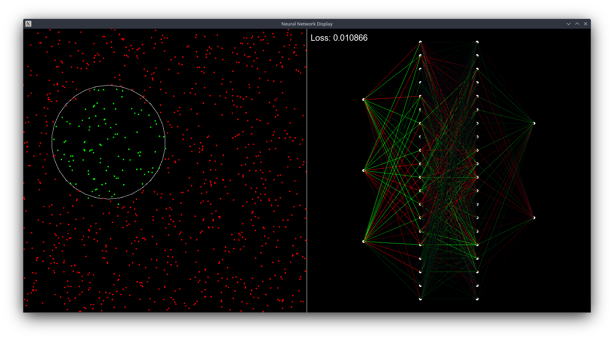

# NN-From-Scratch

A practice project to write a neural network in c++

## Implementations

Testing grounds for different implementation variants:

* `With Class` - The first variant. Most of the parts of a neural network are abstracted and using vectors as data containers makes it relatively simple to write and understand
* `Without Abstraction (Vector)` - The second variant. This is just pure functions which are used to do the same exact thing as the previous variant. Turned out to be simpler to write and to use, because all of the variables are global and you get more control on what to save and where, which gives good performance increase
* `Matrix` - The third variant. This is the most abstracted variant, because the entire implementation revolves around the Matrix class. At the end it turned out to be much slower than the previous variants, but it did help to make me understand the linear algebra behind neural networks
* `Without Abstraction (Array)` - The final variant. By far the fastest. It is the same as with the vector variant the only difference being using arrays instead of vectors. This variant is later used to create the FNN class which I later use for the display

I attempted to use threads to speed up the training process, but it only slowed it down in. However, I only used threads for speeding up loops, which might have had a bigger overhead than benefits. Running different training data in parallel may increase the performance, but for now it's fast enough to be used for display

# FNN

Short for Fast Neural Network, is the main class I'll be using in the display and maybe other uses in the future

It has got all the standard functions an NN should have (I think), but the key thing here is the access to all the variables that are being saved, calculated or generated in some manner. By saving and storing all of these variables, I can avoid a lot of redundant computations, which all let to an increased performance. I think this is one of the rare cases where abstraction isn't necessarily a good idea 

# Visual

This is mostly for that cool wow effect and because for passion projects such as these an impressive design makes me happy

For training data, I give the model points in 2D and train it to recognize if the points are inside some predefined circle. Because of this, on the left is this circle and the testing data that is given to the model (not the training data). The green are the points that the model thinks are inside the circle, and the red - outside

On the right is the visual representation of the model, with the nodes and weights, where the green is positive and red is negative and the more vibrant it is, the bigger its value is

# Test

This is the folder where I tried out and tested different snippets of code which I then implemented in the solutions. I mostly used this to write threads which would always be active but asleep most of the time and would wake up when the main program would request something to be done. However, as mentioned above, it only made the solutions slower, so I dropped it

Another part I wanted to implement was doing simple operations on the GPU, but the Nvidia driver version and CUDA supported version didn't match and the driver isn't getting an upgrade any time soon, so the only option left is to use opengl